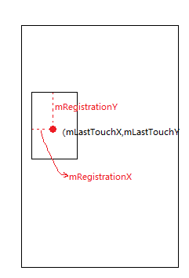

# DragLayer分析
----

## 1. 概述
DragLayer主要提供了两个功能：
1. [捕获Touch事件，结合DragController实现Launcher内拖拽效果。](./DragAnalysis.md)
2. [DragView放下动画。](./DragLayerAnim.md)

当然DragLayer的Touch事件也不仅仅是被拖拽消费掉。在onInterceptTouchEvent函数里包括了各种消耗Touch事件的情况。
1. AppWidgetResizeFrame.onControllerInterceptTouchEvent 是判断是否为桌面长按小部件调整大小。
2. mDragController.onControllerInterceptTouchEvent 是判断是否为拖拽图标等。
3. mAllAppsController.onControllerInterceptTouchEvent 是判断是否为拉起应用页。
4. widgetsBottomSheet.onControllerInterceptTouchEvent 是判断是否应用创建小部件的WidgetsBottomSheet需要创建小部件或者消失。参见[固定快捷方式和小部件](https://developer.android.google.cn/about/versions/oreo/android-8.0.html)
5. PinchToOverviewListener.onControllerInterceptTouchEvent 是判断是否为创建Pinch Shortcut。 参见[App Shortcuts](https://developer.android.google.cn/about/versions/oreo/android-8.0.html)

DragLayer也提供了子View在DragLayer中的位置，这是实现拖拽基础。

## 2. DragLayer、DragView、DragController之间关系
用一句话来概括就是DragLayer捕获Touch事件，DragController将事件转发到对应的DropTarget中，DragView显示被拖拽View的位置。
需要注意的一点是在Launcher3-oreo中DropTarget处理拖拽具体逻辑已经交给DragDriver而不是DragController自己处理了。在DragController.startDrag会创建DragDriver并在DragController.onControllerTouchEvent将Touch事件委托给DragDriver处理。

## 3. DragView 分析
### 3.1 DragView拖动分析
在DragView中有几个和拖动有关的重要变量mRegistrationX mRegistrationY mLastTouchX mLastTouchY mAnimatedShiftX mAnimatedShiftY。  

|变量     |作用     |
| ------- | :-----: |
| mRegistrationX<br>mRegistrationX | 是记录长按拖拽图标的初始位置。|
| mLastTouchX<br>mLastTouchY | 是当前Touch事件中的 x,y 坐标。|
| mAnimatedShiftX<br>mAnimatedShiftY | 是PinchShortcut的长按的的初始位置距离DragView的中心偏移。|
首先来看DragView的move函数
```java {.line-numbers}

    public void move(int touchX, int touchY) {
        mLastTouchX = touchX;
        mLastTouchY = touchY;
        applyTranslation();
    }

    private void applyTranslation() {
        setTranslationX(mLastTouchX - mRegistrationX + mAnimatedShiftX);
        setTranslationY(mLastTouchY - mRegistrationY + mAnimatedShiftY);
    }

```
_DragView.java_

mRegistrationX mRegistrationX mLastTouchX mLastTouchY具体作用如下图所示：  
  
其中mAnimatedShiftX mAnimatedShiftY一般为0，只有拖拽应用快捷方式时才会有值，并且记录的是当前触摸坐标与DragView中心的偏移。
```java {.line-numbers}

    @Override
    public boolean onTouch(View v, MotionEvent ev) {
        // Touched a shortcut, update where it was touched so we can drag from there on long click.
        switch (ev.getAction()) {
            case MotionEvent.ACTION_DOWN:
            case MotionEvent.ACTION_MOVE:
                mIconLastTouchPos.set((int) ev.getX(), (int) ev.getY());
                break;
        }
        return false;
    }

    @Override
    public boolean onLongClick(View v) {

        // ...
          // Move the icon to align with the center-top of the touch point
        mIconShift.x = mIconLastTouchPos.x - sv.getIconCenter().x;
        mIconShift.y = mIconLastTouchPos.y - mLauncher.getDeviceProfile().iconSizePx;
        // ...
        dv.animateShift(-mIconShift.x, -mIconShift.y);
        // ..
    }

```
_ShortcutItemView.java_

```java {.line-numbers}

    public void animateShift(final int shiftX, final int shiftY) {
        if (mAnim.isStarted()) {
            return;
        }
        mAnimatedShiftX = shiftX;
        mAnimatedShiftY = shiftY;
        applyTranslation();
        mAnim.addUpdateListener(new AnimatorUpdateListener() {
            @Override
            public void onAnimationUpdate(ValueAnimator animation) {
                float fraction = 1 - animation.getAnimatedFraction();
                mAnimatedShiftX = (int) (fraction * shiftX);
                mAnimatedShiftY = (int) (fraction * shiftY);
                applyTranslation();
            }
        });
    }

```
_DragView.java_
由DragView.animateShift可知当ShortItemView长按生成DragView的中心最后会和指间重合同时mAnimatedShiftX mAnimatedShiftY变为0。由此可知一般来说DragView.applyTranslation 中mAnimatedShiftX mAnimatedShiftY是为了偏移到中心而设的。  
**如果Shortcut、Folder也需要在长按时将其中心偏移到指间中心，也可以采用ShortcutsItemView一样的方法** 

### 3.2 Oreo拖拽图标内容晃动的动画效果分析

## 4. DragLayer.onInterceptTouchEvent切换mActiveController 分析


