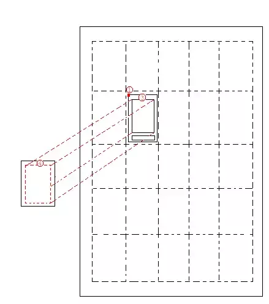

# 拖拽放下动画分析
---
## 1.概述
对于拖拽动画来说，只要计算好拖拽起始位置和最终放下的位置便可以确保动画在视觉上没有差错。由于当前版本拖拽放下时，是处于预览模式，所以还需考虑缩放。由于缩放基本上是中心缩放，最终位置的left,top坐标还要减去(1 - scale)*(width or height)/2。  
总之，拖拽放下动画最为关键的是动画起始位置和结束位置DragView的left,top坐标。
```java {.line-numbers}

    public void animateViewIntoPosition(
            final DragView view,
            final int fromX, final int fromY,
            final int toX, final int toY,
            float finalAlpha, float initScaleX, float initScaleY,
            float finalScaleX, float finalScaleY, Runnable onCompleteRunnable,
            int animationEndStyle, int duration, View anchorView){
                //...
            }

```
由于animateViewIntoPosition的函数声明太长，下面的分析都直接略过。

## 2. 初始位置计算
动画初始位置的left、top坐标就是DragView在DragLayer中的left,top坐标。
```java {.line-numbers}

    //...
    Rect r = new Rect();
    getViewRectRelativeToSelf(dragView, r);
    //...
    final int fromX = r.left;
    final int fromY = r.top;
    //...

```

## 3. 快捷方式的最终位置的计算
快捷方式的最终位置计算可以分为以下几步：  
1. 计算放下位置在CellLayout中的位置。（DragLayer.getDescendantCoordRelativeToSelf 考虑了缩放，当前计算得出的坐标便是预览模式下CellLayout对应的cellX,cellY在DragLayer中的坐标）
2. 计算最终DragView的缩放比例，一般来说``` dragView.getIntrinsicIconScaleFactor()```是1。这一步是为了兼容应用列表与Workspace中的快捷方式大小可能不同。
3. 计算BubbleTextView的缩放后的paddingTop。
4. 减去DragView自身的padding。
5. 计算DragView因中心缩放带来的偏移。  
 
```java {.line-numbers}

    float scale = getDescendantCoordRelativeToSelf((View) child.getParent(), coord);
    scale *= childScale;
    int toX = coord[0];
    int toY = coord[1];
    float toScale = scale;

    toScale = scale / dragView.getIntrinsicIconScaleFactor();

    toY += Math.round(toScale * tv.getPaddingTop());

    if (dragView.getDragVisualizeOffset() != null) {
        toY -=  Math.round(toScale * dragView.getDragVisualizeOffset().y);
    }

    toY -= dragView.getMeasuredHeight() * (1 - toScale) / 2;
    toX -= (dragView.getMeasuredWidth() - Math.round(scale * child.getMeasuredWidth())) / 2;

```  
  

## 4. 文件夹最终位置的计算
文件夹最终位置计算可以分为以下几步：
1. 计算放下位置在CellLayout中的位置。
2. 将DragView中文件夹预览图标的位置与FolderIcon的位置对齐。
(这是由于FolderIcon的DragView也会设置PaddingTop所致)
```java {.line-numbers}

 public DragView beginDragShared(View child,
            DragSource source, ItemInfo dragObject,
            DragPreviewProvider previewProvider
            DragOptions dragOptions) {
        //...
        Point dragVisualizeOffset = null;
        Rect dragRect = null;
        //...
        else if (child instanceof FolderIcon) {
            int previewSize = grid.folderIconSizePx;
            dragVisualizeOffset = new Point(- halfPadding, halfPadding - child.getPaddingTop());
            dragRect = new Rect(0, child.getPaddingTop(), child.getWidth(), previewSize);
        }
        //... 
    }

```
_Workspace.java_

3. 减去因scale导致BlurSizeOutlinePadding偏移
4. 计算DragView因中心缩放带来的偏移。  

```java {.line-numbers}

    //...
    else if (child instanceof FolderIcon) {
        // Account for holographic blur padding on the drag view
        toY += Math.round(scale * (child.getPaddingTop() - dragView.getDragRegionTop()));
        toY -= scale * dragView.getBlurSizeOutline() / 2;
        toY -= (1 - scale) * dragView.getMeasuredHeight() / 2;
         // Center in the x coordinate about the target's drawable
        toX -= (dragView.getMeasuredWidth() - Math.round(scale * child.getMeasuredWidth())) / 2;
    }
    //...

```

## 5. 将快捷方式放入文件夹中最终位置的计算
1. 计算FolderIcon在DragLayer中的位置。
2. 计算预览图标在FolderIcon中的位置的中心。因为拖拽处于预览模式会scale，所以需要乘系数``` scaleRelativeToDragLayer ```。因为getLocalCenterForIndex是计算正常情况下FolderIcon中预览图标的中心，只要乘以``` scaleRelativeToDragLayer ```便是预览情况下的中点。因为对 center[0] center[1]乘以该系数就相当于对式子里的每项乘。
3. 根据中心算出最终位置的left top坐标。  
```java {.line-numbers}

 private void onDrop(final ShortcutInfo item, DragView animateView, Rect finalRect,
    float scaleRelativeToDragLayer, int index, Runnable postAnimationRunnable){

    Rect to = finalRect;
    if (to == null) {
        to = new Rect();
        //...
        dragLayer.getDescendantRectRelativeToSelf(this, to);
        //...
    }

    int[] center = new int[2];
    float scale = getLocalCenterForIndex(index, index + 1, center);
    center[0] = (int) Math.round(scaleRelativeToDragLayer * center[0]);
    center[1] = (int) Math.round(scaleRelativeToDragLayer * center[1]);

    to.offset(center[0] - animateView.getMeasuredWidth() / 2,
         center[1] - animateView.getMeasuredHeight() / 2);    

}

```
_FolderIcon.java_

**经过以上分析可知，即使要改成拖拽不进入预览模式，对于整个拖拽系统也没有任何影响，因为它就是``` scaleRelativeToDragLayer == 1```情况。不过现在的布局是基于scale的，所以整体布局需要调整。**


