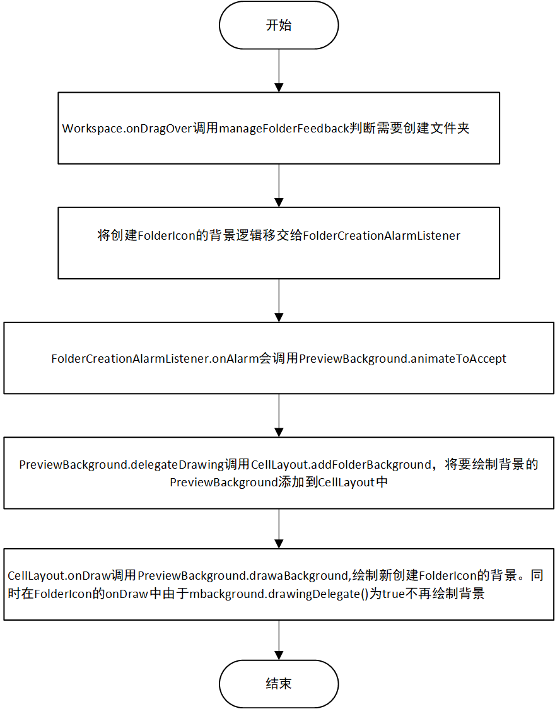
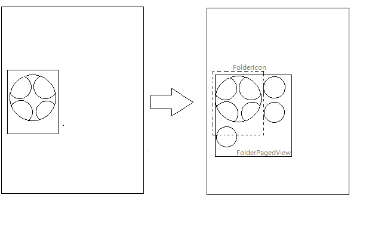
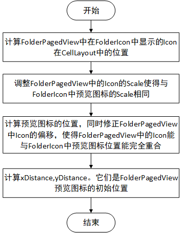

# Folder相关动画
---------------

## 1. FolderIcon的背景动画

### 1.1 文件夹创建时背景绘制
总的来说，文件夹创建时它的背景是在CelllLayout中绘制的，并不是在FolderIcon的Canvas中绘制的。具体流程如下：
  

### 1.2 取消创建文件夹
在Workspace.OnDragExit会调用setCurrentDropLayout其中调用cleanupFolderCreation，清除在CellLayout中创建的FolderIcon背景。此时主要做两件事：
1. PreviewBackground.animateToRest
2.  mFolderCreationAlarm.cancelAlarm

### 1.3 文件夹背景创建动画
FolderIcon的背景动画，主要涉及到PreviewBackground的mScaleAnimator和CellLayout。  
mScaleAnimator是一个ValueAnimator。它主要改变的是PreviewBackground的**mScale**和**mColorMultiplier**  
mScale表示动画过程中的FolderIcon背景圆的scale
```java {.line-numbers} 

    int getScaledRadius() {
        return (int) (mScale * getRadius());
    }

    private void drawCircle(Canvas canvas,float deltaRadius) {
        float radius = getScaledRadius();
        canvas.drawCircle(radius + getOffsetX(), radius + getOffsetY(),
                radius - deltaRadius, mPaint);
    }

```  
mColorMultiplier影响的是FolderIcon预览图的alpha
```java {.line-numbers}

    public int getBgColor() {
        int alpha = (int) Math.min(MAX_BG_OPACITY, BG_OPACITY * mColorMultiplier);
        return ColorUtils.setAlphaComponent(mBgColor, alpha);
    }

    public void drawBackground(Canvas canvas) {
     //...
        mPaint.setColor(getBgColor());
     //...
    }

```
mScaleAnimator会在onAnimationUpdate回调中会触发CellLayout的Invalidate。  
``` java {.line-numbers}

        mScaleAnimator.addUpdateListener(new ValueAnimator.AnimatorUpdateListener() {
            @Override
            public void onAnimationUpdate(ValueAnimator animation) {
                //...
                invalidate();
                //...
            }
        });

    void invalidate() {
        if (mInvalidateDelegate != null) {
            mInvalidateDelegate.invalidate();
        }

        if (mDrawingDelegate != null) {
            mDrawingDelegate.invalidate();
        }
    }

```
PreviewBackground.java

``` java {.line-numbers}

  @Override
    protected void onDraw(Canvas canvas) {
        //....
        for (int i = 0; i < mFolderBackgrounds.size(); i++) {
            PreviewBackground bg = mFolderBackgrounds.get(i);
            cellToPoint(bg.delegateCellX, bg.delegateCellY, mTempLocation);
            canvas.save();
            canvas.translate(mTempLocation[0], mTempLocation[1]);
            bg.drawBackground(canvas);
            if (!bg.isClipping) {
                bg.drawBackgroundStroke(canvas);
            }
            canvas.restore();
        }
        //...
    }

``` 
CellLayout.java

**其中的动画使用方式也是值得学习的：ValueAnimator更新相关动画属性->动画中调用对应控件的Invalidate->控件重绘(ondraw)使用相关动画属性值。**
这样做可以避免多次Invalidate，在一次动画过程中只会有一次Invalidate。

## 2. 文件夹打开 / 关闭动画
Folder.animateOpen其实有两种实现方式一种是Folder.getOpeningAnimator，另一种是FolderAnimationManager.getOpeningAnimator。Folder.getOpeningAnimator是以前版本中的文件夹打开动画的实现；当前版本是采用的后者。FolderAnimationManager.getAnimator主要做了这几件事： 
1. 计算出FolderIcon在DragLayer中的位置。同时计算出当前FolderIcon的Scale。 
2. 缩小Folder使得Folder中图标与FolderIcon的预览的图标尺寸相同。
3. 要使FolderPagedView中的图标与FolderIcon中的图标对其，Folder需要的偏移是多少(xDistance,yDistance)。
4. 计算初始需要裁剪的reveal参数。
5. addPreviewItemAnimators 在FolderIcon中预览图标的动画。

### 2.1 1-5步骤取得效果
其中1-4取得的效果类似下面两张图的变化：


至于第4步中startRect为什么每项都要除以initialScale，我的猜测是RoundedRectRevealOutlineProvider中会考虑控件的Scale，这样做能抵消```java mFolder.setScaleX(scale);mFolder.setScaleY(scale);```带来的问题。
```java {.line-numbers}

    // Set up the reveal animation that clips the Folder.
    int totalOffsetX = paddingOffsetX + previewItemOffsetX;
    Rect startRect = new Rect(
            Math.round(totalOffsetX / initialScale),
            Math.round(paddingOffsetY / initialScale),
            Math.round((totalOffsetX + initialSize) / initialScale),
            Math.round((paddingOffsetY + initialSize) / initialScale));

```
比如View源码中的setScaleX
```java {.line-numbers}

    /**
     * Sets the amount that the view is scaled in x around the pivot point, as a proportion of
     * the view's unscaled width. A value of 1 means that no scaling is applied.
     *
     * @param scaleX The scaling factor.
     * @see #getPivotX()
     * @see #getPivotY()
     *
     * @attr ref android.R.styleable#View_scaleX
     */
    public void setScaleX(float scaleX) {
        if (scaleX != getScaleX()) {
            invalidateViewProperty(true, false);
            mRenderNode.setScaleX(scaleX);
            invalidateViewProperty(false, true);

            invalidateParentIfNeededAndWasQuickRejected();
            notifySubtreeAccessibilityStateChangedIfNeeded();
        }
    }

```
#### 2.2 addPreviewItemAnimators效果
这个动画主要是使得FolderPagedView中在FolderIcon中预览的icon，在最开始完全与FolderIcon中预览图标完全重合。文件夹打开时FolderIcon的预览图有个扩张的效果，关闭的时候有个收缩的效果。


