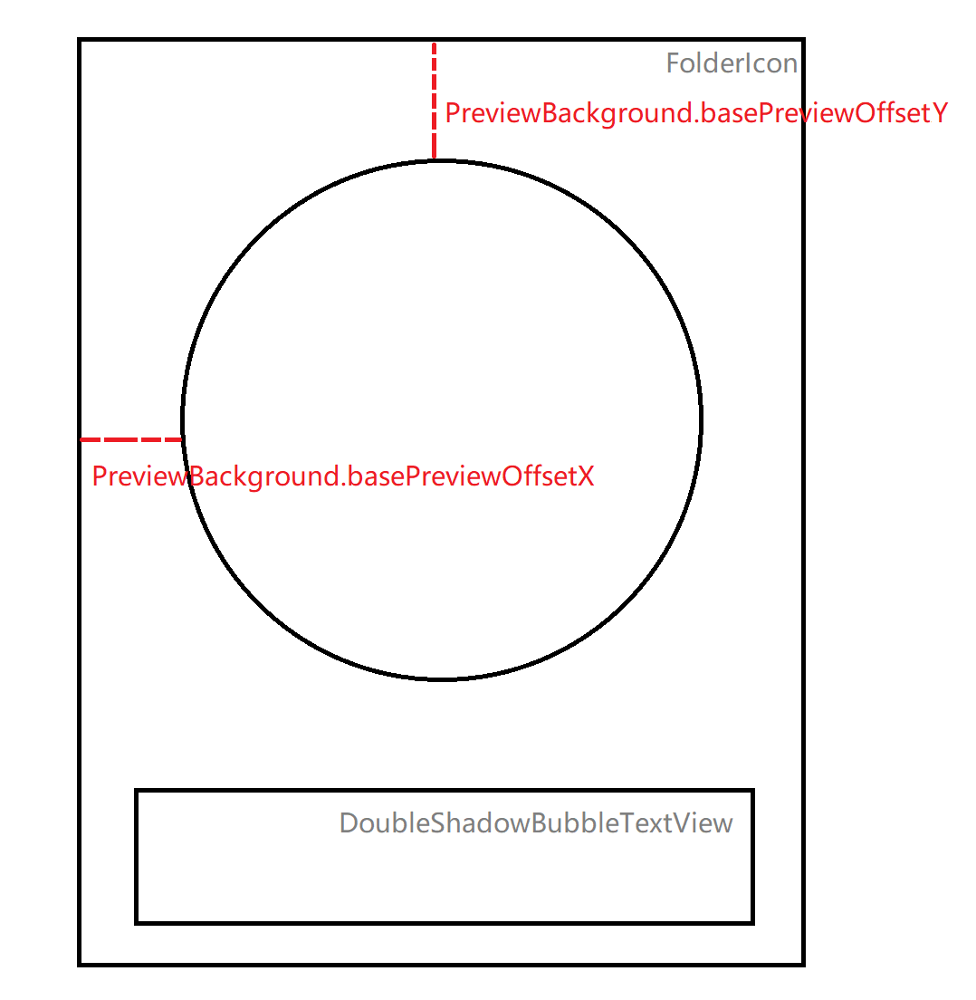

# Folder FolderIcon概要
---------------------

## FolderIcon概览


一个文件夹的图标主要由FolderIcon和DoubleShadowBubbleTextView组成，其中文件夹预览图标主要在FolderIcon的onDraw中绘制，DoubleShadowBubbleTextView主要负责显示文件夹图标的标题并渲染文字的阴影。

### 预览图在FolderIcon中的位置分析
文件夹预览图在FolderIcon中的位置主要由PreviewBackground.basePreviewOffsetX 和 PreviewBackground.basePreviewOffsetY 决定。具体在(PreviewBackground.setup方法中确定)

```java {.line-numbers}

    basePreviewOffsetX = (availableSpace - this.previewSize) / 2;
    basePreviewOffsetY = previewPadding + grid.folderBackgroundOffset + topPadding;

```
basePreviewOffsetX很好理解实际上就是：


