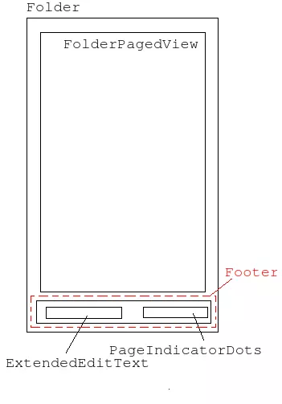

# FolderIcon Folder概要
---------------------

## 1. FolderIcon概览


一个文件夹的图标主要由FolderIcon和DoubleShadowBubbleTextView组成，其中文件夹预览图标主要在FolderIcon的onDraw中绘制，DoubleShadowBubbleTextView主要负责显示文件夹图标的标题并渲染文字的阴影。

### 1.1 预览图在FolderIcon中的位置分析
文件夹预览图在FolderIcon中的位置主要由PreviewBackground.basePreviewOffsetX 和 PreviewBackground.basePreviewOffsetY 决定。具体在(PreviewBackground.setup方法中确定)

```java {.line-numbers}

    basePreviewOffsetX = (availableSpace - this.previewSize) / 2;
    basePreviewOffsetY = previewPadding + grid.folderBackgroundOffset + topPadding;

```
basePreviewOffsetX很好理解实际上就是：


basePreviewOffsetY中的previewPadding实际为 grid.folderIconPreviewPadding。  
basePreviewOffsetY的grid.folderBackgroundOffset决定的是预览图标与DoubleShadowBubbleTextView之间的距离。实际这个值为负，使得这两者之间存在间距。  
basePreviewOffsetY的topPadding是FolderIcon自身topPadding。

### 1.2 预览图标在FolderIcon中的排布
文件夹的预览图标排布具体是在FolderIcon的dispatchDraw中调用PreviewItemManager.recomputePreviewDrawingParams完成的，最终具体工作由FolderIcon定义的PreviewLayoutRule接口的实现完成的。在目前具体是调用**ClippedFolderIconLayoutRule**完成图标排布。关键实现是ClippedFolderIconLayoutRule.getPosition其代码如下：

```java  {.line-numbers}

    private void getPosition(int index, int curNumItems, float[] result) {
        //......
        // Map the location along the circle, and offset the coordinates to represent the center
        // of the icon, and to be based from the top / left of the preview area. The y component
        // is inverted to match the coordinate system.
        result[0] = mAvailableSpace / 2 + (float) (radius * Math.cos(theta) / 2) - halfIconSize;
        result[1] = mAvailableSpace / 2 + (float) (- radius * Math.sin(theta) / 2) - halfIconSize;

    }

```

这个函数result数组具体是返回待排布图标的(left,top)坐标，下面结合图具体说明result[0]和result[1]。图中O点表示FolderIcon预览图标的圆心，O1表示某个预览图标的的圆心，A表示对应预览图标的(left,top)坐标
  
  
  
我们知道android中View的坐标系与寻常的直角坐标系y轴是相反的，故O1的y坐标中- radius * Math.sin(theta) / 2 取了负号。  
  

**若要实现自己的FolderIcon的预览图中的图标排布只需实现接口FolderIcon.PreviewLayoutRule即可**

### 1.3 FolderIcon预览图在Canvas绘制分析

```java {.line-numbers}

    protected void dispatchDraw(Canvas canvas) {
        super.dispatchDraw(canvas);

        if (!mBackgroundIsVisible) return;

        mPreviewItemManager.recomputePreviewDrawingParams();

        if (!mBackground.drawingDelegated()) {
            mBackground.drawBackground(canvas);
        }

        if (mFolder == null) return;
        if (mFolder.getItemCount() == 0 && !mAnimating) return;

        final int saveCount;

        if (canvas.isHardwareAccelerated()) {
            saveCount = canvas.saveLayer(0, 0, getWidth(), getHeight(), null,
                    Canvas.HAS_ALPHA_LAYER_SAVE_FLAG | Canvas.CLIP_TO_LAYER_SAVE_FLAG);
        } else {
            saveCount = canvas.save(Canvas.CLIP_SAVE_FLAG);
            if (mPreviewLayoutRule.clipToBackground()) {
                canvas.clipPath(mBackground.getClipPath(), Region.Op.INTERSECT);
            }
        }

        mPreviewItemManager.draw(canvas);

        if (mPreviewLayoutRule.clipToBackground() && canvas.isHardwareAccelerated()) {
            mBackground.clipCanvasHardware(canvas);
        }
        canvas.restoreToCount(saveCount);

        if (mPreviewLayoutRule.clipToBackground() && !mBackground.drawingDelegated()) {
            mBackground.drawBackgroundStroke(canvas);
        }

 
added in API level 21       drawBadge(canvas);
    }

```
上述代码可以总结为如下流程图  


#### 1.3.1 绘制背景及阴影
这个绘制背景主要在PreviewBackground的drawBackground实现的，其实这个主要也没什么好分析的。目前实现很简单，具体如下代码:  
```java {.line-numbers}

    public void drawBackground(Canvas canvas) {
        mPaint.setStyle(Paint.Style.FILL);
        mPaint.setColor(getBgColor());

        drawCircle(canvas, 0 /* deltaRadius */);

        drawShadow(canvas);
    }

```
**主要文件夹的背景要支持自定义主题的话，就要重写这个绘制逻辑。相应的如果此时还需要阴影那么绘制顺序可能就要变下，比如将阴影绘制放到clipToBackground之后？**

#### 1.3.2 关于canvas.savelayer的一点参考
[这里](http://blog.csdn.net/cquwentao/article/details/51423371)

**如果文件夹的主题也需要有前景、蒙版和背景这样的层次，那么完全可以通过设定这些在canvas的savelayer和restore来实现。**  
其中Canvas的int saveLayer (float left, float top, float right, float bottom, Paint paint)是在**Api Level 21** 后出现的，需要做兼容性处理，比如用int saveLayer (float left, float top, float right, float bottom, Paint paint, int saveFlags)，查阅6.0源码可知:
```java {.line-numbers}

    /**
     * Convenience for saveLayer(left, top, right, bottom, paint, {@link #ALL_SAVE_FLAG})
     */
    public int saveLayer(float left, float top, float right, float bottom, @Nullable Paint paint) {
        return saveLayer(left, top, right, bottom, paint, ALL_SAVE_FLAG);
    }

```

## 2. Folder
Folder是文件夹展开的根容器，如下图所示。
  
Folder主要提供了两个功能：
1.为图标在文件夹内拖拽提供了支持。  
2.[文件夹打开关闭的动画。](./Animation/folder_create_delete.md)  

**对于第一点有个值得注意的地方**
先看拖拽文件夹中的图标，动态排序的方法Folder.getTargetRank。它将在Folder.onDragOver中调用。
```java {.line-numbers}

    private int getTargetRank(DragObject d, float[] recycle) {
        recycle = d.getVisualCenter(recycle);
        return mContent.findNearestArea(
                (int) recycle[0] - getPaddingLeft(), (int) recycle[1] - getPaddingTop());
    }

```
再看FolderPagedView这个方法的申明：
```java {.line-numbers}

    /**
     * @return the rank of the cell nearest to the provided pixel position.
     */
    public int findNearestArea(int pixelX, int pixelY) 

```
可知它是根据当前手指坐标（pixelX,pixelY）找到最近可以放置被拖拽图标的位置。在回到getTargetRank可知它传给FolderPagedView.findNearestArea点的坐标是基于FolderIcon的左上角的。其中就带来了个限制：**如果左上角是Footer的话，那么传给findNearestArea就存在一个Footer高度的偏移。上图Folder的布局除去Padding，可以认为FolderPagedView和其是完全重合的。**
这点限制如果在遇到自定义文件夹布局同时又想复用Folder绝大部分逻辑的时候就会遇到。

