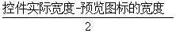

# Folder FolderIcon概要
---------------------

## FolderIcon概览


一个文件夹的图标主要由FolderIcon和DoubleShadowBubbleTextView组成，其中文件夹预览图标主要在FolderIcon的onDraw中绘制，DoubleShadowBubbleTextView主要负责显示文件夹图标的标题并渲染文字的阴影。

### 预览图在FolderIcon中的位置分析
文件夹预览图在FolderIcon中的位置主要由PreviewBackground.basePreviewOffsetX 和 PreviewBackground.basePreviewOffsetY 决定。具体在(PreviewBackground.setup方法中确定)

```java {.line-numbers}

    basePreviewOffsetX = (availableSpace - this.previewSize) / 2;
    basePreviewOffsetY = previewPadding + grid.folderBackgroundOffset + topPadding;

```
basePreviewOffsetX很好理解实际上就是：



basePreviewOffsetY中的previewPadding实际为 grid.folderIconPreviewPadding。  
basePreviewOffsetY的grid.folderBackgroundOffset决定的是预览图标与DoubleShadowBubbleTextView之间的距离。实际这个值为负，使得这两者之间存在间距。  
basePreviewOffsetY的topPadding是FolderIcon自身topPadding。

### 预览图标在FolderIcon中的排布
文件夹的预览图标排布具体是在FolderIcon的dispatchDraw中调用PreviewItemManager.recomputePreviewDrawingParams完成的，最终具体工作由FolderIcon定义的PreviewLayoutRule接口的实现完成的。在目前具体是调用**ClippedFolderIconLayoutRule**完成图标排布。关键实现是ClippedFolderIconLayoutRule.getPosition其代码如下：

```java  {.line-numbers}

    private void getPosition(int index, int curNumItems, float[] result) {
        // The case of two items is homomorphic to the case of one.
        curNumItems = Math.max(curNumItems, 2);

        // We model the preview as a circle of items starting in the appropriate piece of the
        // upper left quadrant (to achieve horizontal and vertical symmetry).
        double theta0 = mIsRtl ? 0 : Math.PI;

        // In RTL we go counterclockwise
        int direction = mIsRtl ? 1 : -1;

        double thetaShift = 0;
        if (curNumItems == 3) {
            thetaShift = Math.PI / 6;
        } else if (curNumItems == 4) {
            thetaShift = Math.PI / 4;
        }
        theta0 += direction * thetaShift;

        // We want the items to appear in reading order. For the case of 1, 2 and 3 items, this
        // is natural for the circular model. With 4 items, however, we need to swap the 3rd and
        // 4th indices to achieve reading order.
        if (curNumItems == 4 && index == 3) {
            index = 2;
        } else if (curNumItems == 4 && index == 2) {
            index = 3;
        }

        // We bump the radius up between 0 and MAX_RADIUS_DILATION % as the number of items increase
        float radius = mRadius * (1 + MAX_RADIUS_DILATION * (curNumItems -
                MIN_NUM_ITEMS_IN_PREVIEW) / (MAX_NUM_ITEMS_IN_PREVIEW - MIN_NUM_ITEMS_IN_PREVIEW));
        double theta = theta0 + index * (2 * Math.PI / curNumItems) * direction;

        float halfIconSize = (mIconSize * scaleForItem(index, curNumItems)) / 2;

        // Map the location along the circle, and offset the coordinates to represent the center
        // of the icon, and to be based from the top / left of the preview area. The y component
        // is inverted to match the coordinate system.
        result[0] = mAvailableSpace / 2 + (float) (radius * Math.cos(theta) / 2) - halfIconSize;
        result[1] = mAvailableSpace / 2 + (float) (- radius * Math.sin(theta) / 2) - halfIconSize;

    }

```

这个函数result数组具体是返回待排布图标的(left,top)坐标，下面结合图具体说明result[0]和result[1]。图中O点表示FolderIcon预览图标的圆心，O1表示某个预览图标的的圆心，A表示对应预览图标的(left,top)坐标


我们知道android中View的坐标系与寻常的直角坐标系y轴是相反的，故O1的y坐标中- radius * Math.sin(theta) / 2 取了负号。  
  

