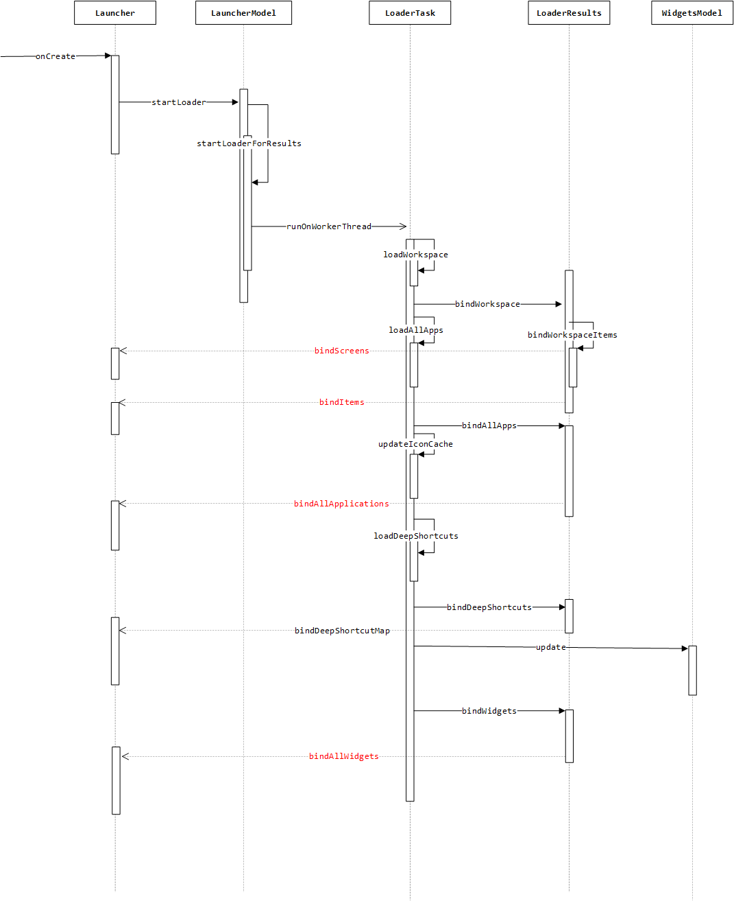
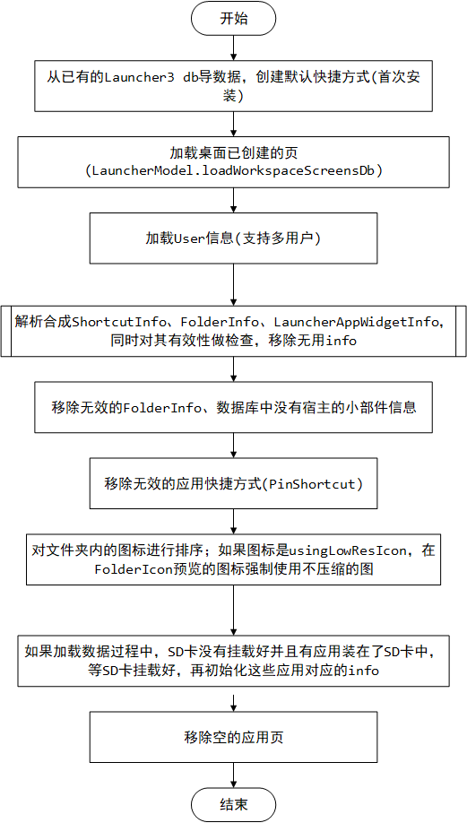

# LauncherModel分析
---

## 1. 概述
LauncherModel可以认为是Launcher3的数据中心和数据管理者，它的职责有：
1. Launcher启动从数据库中加载、校验数据。它把具体的工作具体委托给了**LoaderTask**。  
2. 监听应用的各种状态比如新安装一个应用、卸载一个应用、应用不可用(安装在sdcard)、应用升级等等。  
3. 监听当前各种环境的改变以决定Launcher是否要重新加载。比如配置是否改变、是否切换语言。  
4. 通过**Callbacks**将当前变化及时通知UI。

LauncherModel涉及到的比较重要的类有： 

|变量     |作用     |  
| ------- | :-----: |  
| Launcher | 实现了LauncherModel定义的接口Callbacks，LauncherModel通过这个接口通知LauncherUI界面更新。|  
| [LoaderTask](LoaderTask.md) | 加载Launcher3的数据包括桌面图标、小部件信息、所有应用信息、deep shortcuts。|  
| LauncherProvider | 提供了对Launcher3数据库的增删改查操作，比较重要的是两张表，favorites表和icons表。|  
| [PackageUpdatedTask](PackageUpdatedTask.md) | 应用安装，卸载、升级等变化时处理类，它将同步更新Launcher的内存信息。 |  
| BgDataModel | 存储了Launcher3中所有的图标、文件夹、小部件等信息。相当于内存缓存。 |  
| ModelWriter | 暴露给Launcher对数据库操作的接口，内部将数据库操作投送到线程池中执行。 |  
| LoaderCursor | 将Launcher3数据库中的信息转为info的工具类。 |  
| LoaderResults | Launcher3启动加载完数据，更新UI辅助类。 |

## 2. Launcher3启动加载数据流程
Launcher3启动加载数据大致流程如下，接下来会比较详细的分析loadWorkspace以及loadAllApps过程。

### 2.1 加载桌面快捷方式流程
加载快捷方式流程，即loadWorkspace如下：  

### 2.2 加载应用页信息

## 3. 安装更新应用流程
### 3.1 安装应用流程
//TODO
### 3.2更新应用流程
//TODO
## 4. LauncherModel通知UI更新流程
//TODO

